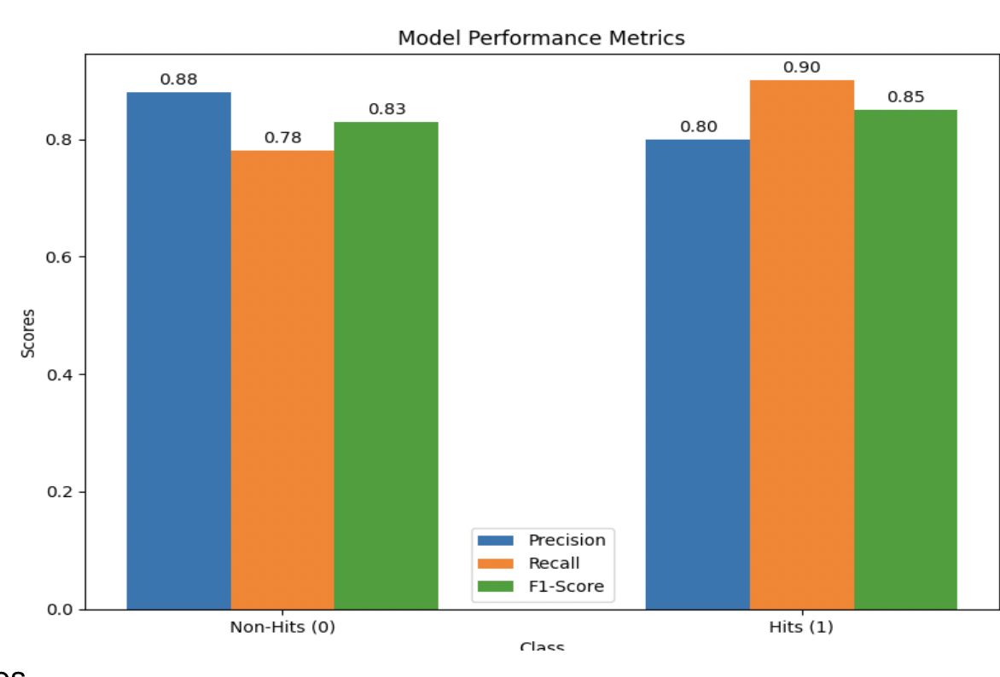
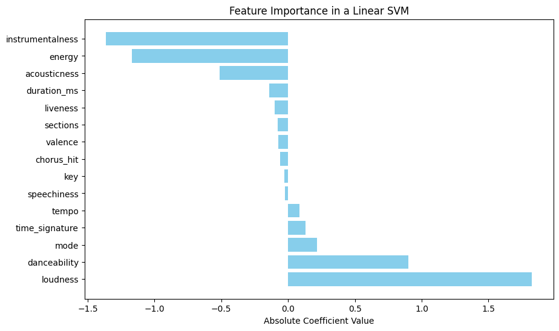
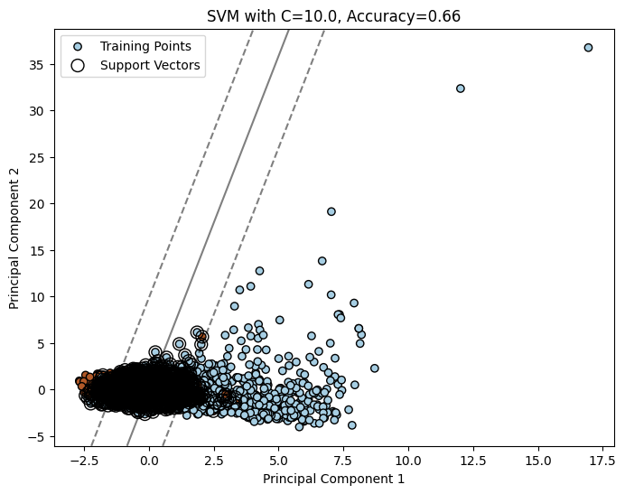
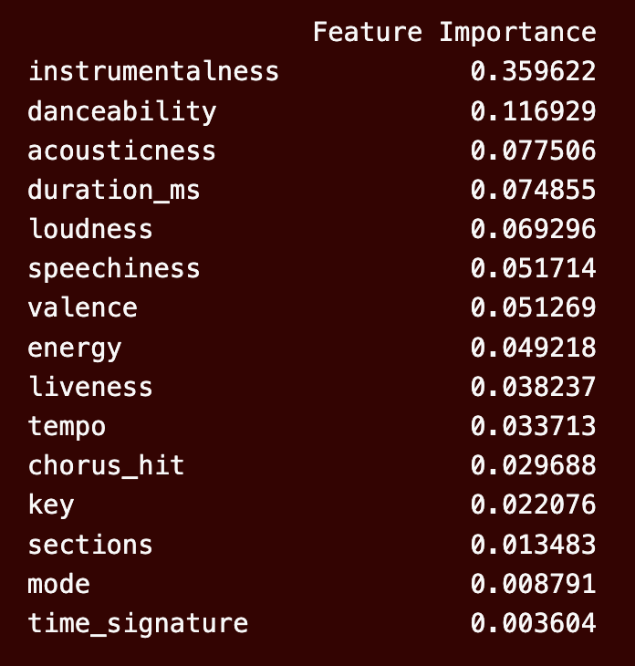
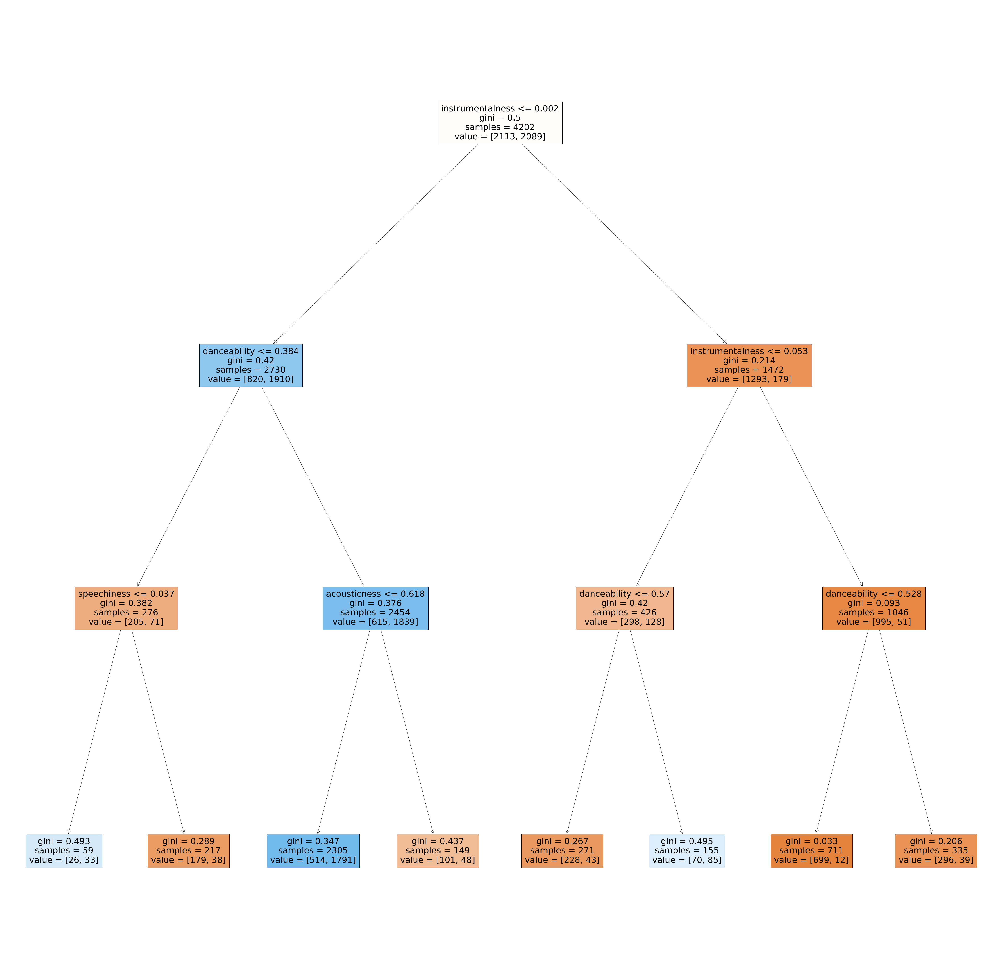
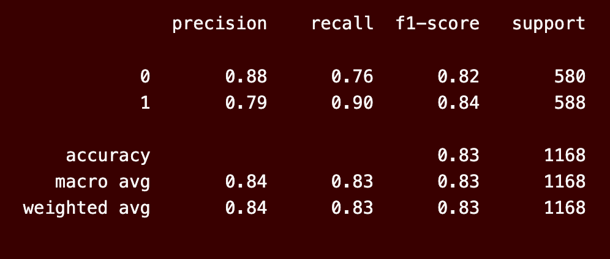
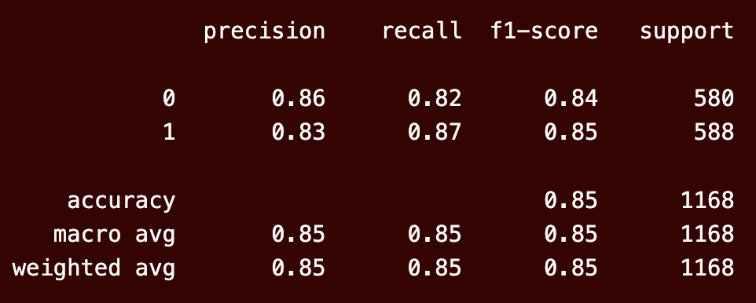
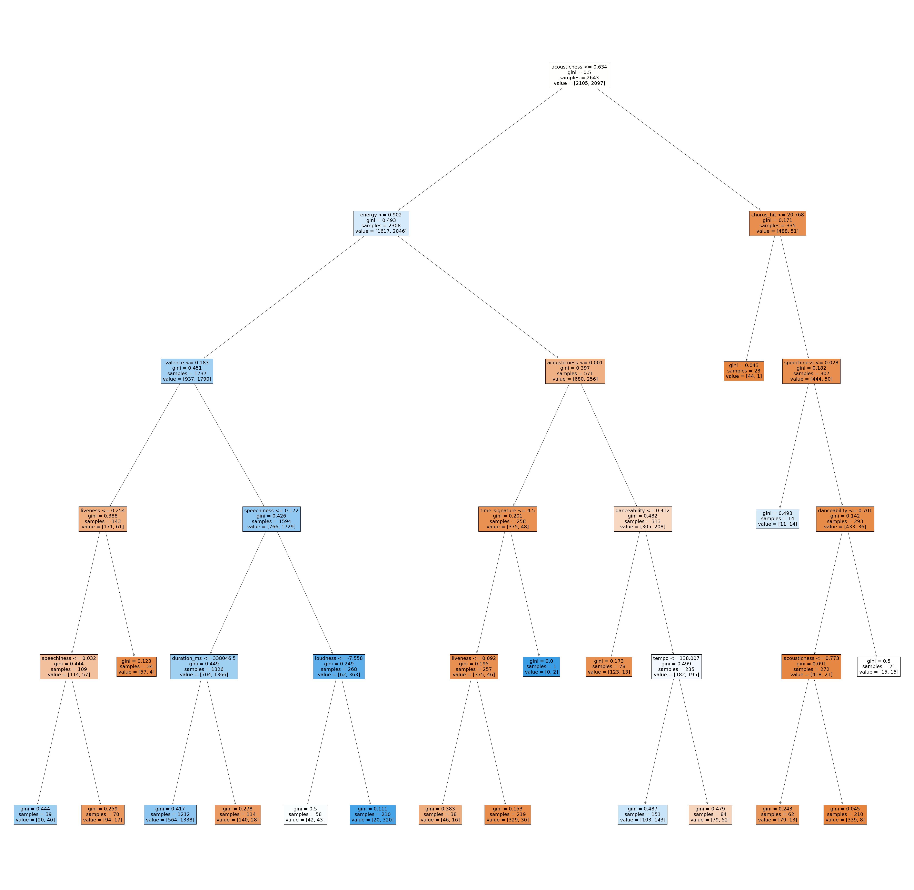
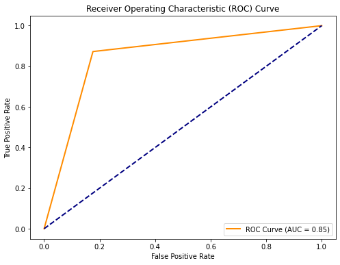

---
output:
  pdf_document: default
  html_document: default
---

# Decoding Decades: Developing a Predictive Model for Musical Success Using Spotify Data

## Team Members :
- Ashwin Muthuraman
- Kanishk Goel
- Ram Mannuru
- Srinivas

# Abstract:

In the evolving music industry, predicting song success is crucial. This research explores machine learning models—logistic regression, decision trees, support vector machines (SVM), random forests, and gradient boosting—to uncover their effectiveness in discerning hit songs. The study aims to provide insights for informed decision-making in the music domain.

# Introduction:

As the music industry adapts, machine learning emerges as a tool for forecasting song success. This study assesses logistic regression, decision trees, SVM, random forests, and gradient boosting to unravel their strengths in identifying hit songs.

# Objective:

Evaluate and compare machine learning models in predicting song success, offering a nuanced understanding of their effectiveness.

# Methodology:

The research employs logistic regression for baseline modeling, decision trees for interpretability, SVM for nuanced classification, random forests for ensemble learning, and gradient boosting for enhanced predictive power.

# Structure:

The paper proceeds with an overview of the dataset, exploratory data analysis, and detailed analyses of logistic regression, decision trees, SVM, random forests, and gradient boosting. A comparative analysis follows, concluding with key findings and implications. This research contributes insights at the intersection of music and machine learning, shaping the landscape of predictive modeling in song success.

# Dataset:

The dataset utilized is the "Spotify Hit Predictor Dataset (1960-2019)," sourced from Kaggle. This dataset contains various attributes extracted from tracks using Spotify's Web API. The tracks are categorized as either '1' (indicating a 'Hit') or '0' (indicating a 'Flop') based on specific criteria set by the dataset's author.

This dataset lends itself to the creation of a classification model aimed at predicting whether a given track will achieve 'Hit' status or not. The dataset encompasses a range of features, including Track name, Artist, URI, Danceability, Energy, Key, Loudness, Mode, Speechiness, Acousticness, Instrumentalness, Liveness, Valence, Tempo, Duration_ms, Time_Signature, Chorus_Hit, Sections, and the Target variable.

# SMART questions:

1. What are the top three audio features strongly associated with hit songs?

2. How much improvement in accuracy, precision, and recall was achieved in the SVM RBF kernel model after hyperparameter tuning compared to the initial model?

3. How much did the accuracy and interpretability of the decision tree model improve after pruning compared to the initial deep tree

4. What specific performance metrics (e.g., accuracy, AUC) can be used to assess the effectiveness of the random forest model with default parameters, and how did it compare to other models?

5. What recommendations can be made regarding the choice of machine learning model for predicting song success based on the comparative analysis of SVM, decision trees, and random forests?

The questions were developed to address specific aspects of our analysis and decision-making process. We aimed to understand the key audio features influencing song success and to select the best machine learning model for prediction. Each question was tailored to extract precise information relevant to our research objectives. For example, we asked about the top hit-associated audio features to pinpoint influential factors, quantified performance improvements to gauge the impact of optimization, and compared metrics to evaluate model effectiveness. These questions were designed to guide our investigation and ensure that we obtained relevant insights to make informed decisions.

# Exploratory Data Analysis:
Exploratory Data Analysis (EDA) was conducted to gain insights into the dataset's statistics, structure, and the significance of different feature values. During this process, skewed data in several features were normalized. Additionally, through univariate analysis and the F-test, we identified the most influential features.

From our comparative analysis, we made intriguing observations. There was a significant contrast in loudness between hit and flop songs, with hit songs having a substantially higher loudness level of 3.56 units when compared to flop songs

Additionally, the "key" feature appears to have a relatively high p-value (0.755) in the F-test, suggesting it may not be statistically significant in distinguishing between hit and flop songs.

---
# Logistic Regression Modeling:

This section analyzes the performance of the logistic regression model used for predicting hit songs.

## Model Performance Metrics

* **Accuracy:** 0.84

### Hits:

* **Precision:** 0.80
* **Recall:** 0.90
* **F1-score:** 0.85
* **Support:** 588

### Non-hits:

* **Precision:** 0.88
* **Recall:** 0.78
* **F1-score:** 0.83
* **Support:** 580

## Performance metrics :

## Interpretation

* The accuracy of the model is 84%, indicating that it correctly predicts 84% of the songs.
* The recall for hits is 90%, meaning that the model correctly identifies 90% of the hit songs.
* The precision for hits is 80%, signifying that 80% of the songs predicted as hits are actually hits.
* The F1-score for hits is 85%, a harmonic mean of precision and recall, indicating a good balance between the two metrics.
* The confusion matrix shows that the model has more true negatives (correctly predicted non-hits) than false positives (incorrectly predicted hits). This suggests that the model is better at identifying non-hits than hits.
* The AUC of 0.91 indicates that the model is good at distinguishing between hits and non-hits.

## Observations

The logistic regression model performs well on this task, with an accuracy of 84% and a high recall for hits (90%). However, the model is better at identifying non-hits than hits, as evidenced by the higher precision for non-hits (88%) and the confusion matrix. This suggests that there may be some room for improvement in the model's ability to identify hit songs.

---

# SVM Modeling Introduction:

In the initial phase of our SVM modeling for music classification using the Spotify dataset, our focus was on understanding the role of different kernels and the regularization parameter (C) in the SVM model.

## Kernel Selection:

SVM allows for various kernels, including linear, Radial Basis Function (RBF), Sigmoid, and Polynomial. The choice of kernel determines how the model captures complex patterns within the data. In this context, we explored the impact of different kernels to identify the one that best suits our music classification task.

## Regularization Parameter (C):

The regularization parameter (C) in the SVM model is crucial for controlling the balance between fitting the training data well and generalizing to new, unseen data. A large C value results in a smaller margin of the hyperplane, which can lead to overfitting, while a small C value allows for a larger margin, risking underfitting.

## Significance to Problem Statement:

Understanding the role of kernel selection and regularization in SVM modeling is essential for addressing the challenges posed by diverse music features. This knowledge will guide us in refining the SVM model to achieve optimal classification performance and provide insights into the significant features influencing music success.

---

# Linear Kernel:

In the second phase of our SVM modeling, we focused on employing a linear kernel to build the initial SVM model. This step aimed to assess the model's performance using this simpler form of the kernel.

## Model Performance Metrics:

The linear kernel SVM model was trained and evaluated on the Spotify dataset, comprising various audio features. Key performance metrics were computed to gauge the model's effectiveness in predicting music success.

- **Train Accuracy:** The model exhibited a Train Accuracy of 0.82, indicating its proficiency in learning from the training set.
- **Test Accuracy:** The Test Accuracy maintained a high value of 0.82, suggesting robust generalization to unseen music tracks.
- **Precision:** Precision, representing the accuracy of positive predictions, stood at 0.83.
- **Recall:** The Recall metric, measuring sensitivity to positive instances, reached 0.82.
- **F1 Score:** The balanced F1 Score of 0.82 emphasized the harmonious trade-off between precision and recall.

## Challenges Identified:

Despite the impressive accuracy metrics, a closer examination revealed a limitation in recall (0.82), indicating challenges in identifying positive instances. This observation prompted further investigation and steps to address the recall limitation.

## Observations:

The evaluation of the linear kernel model provides valuable insights into its initial performance on music classification. Recognizing the recall limitation is crucial for refining the model and achieving a more balanced prediction of music success, aligning with our overarching goal of developing an effective classification model for the Spotify dataset.

---

# RBF Kernel:

Building on the insights gained from the linear kernel model, we progressed to implement the Radial Basis Function (RBF) kernel in our SVM model. The transition aimed to enhance the model's complexity and capture more intricate patterns within the Spotify dataset.

## Model Performance Metrics:

The SVM model with the RBF kernel underwent rigorous evaluation, and key performance metrics were assessed to gauge its effectiveness in predicting music success.

- **Train Accuracy:** The RBF kernel SVM model showcased an improved Train Accuracy of 0.86, highlighting its proficiency in learning from the training set.
- **Test Accuracy:** The Test Accuracy maintained a high value of 0.85, indicating robust generalization to unseen music tracks.
- **Precision:** Precision, representing the accuracy of positive predictions, reached a commendable value of 0.85.
- **Recall:** The Recall metric, measuring sensitivity to positive instances, achieved a noteworthy value of 0.85.
- **F1 Score:** The balanced F1 Score of 0.85 emphasized the harmonious trade-off between precision and recall.

## Possible Reasons for Improvement:

The adoption of the RBF kernel proved effective in capturing complex patterns within the dataset, contributing to the notable enhancements observed in various performance metrics.

## Observations:

The refined model with the RBF kernel signifies a strategic step towards achieving higher accuracy and capturing intricate relationships within the Spotify dataset. This aligns with our overarching goal of developing an effective classification model to discern music success factors.

---

# Hyperparameter Tuning using Grid Search CV:

Recognizing the pivotal role of hyperparameters in SVM models, we employed the GridSearchCV technique to meticulously fine-tune the model. This process aimed to identify the optimal combination of hyperparameters for our RBF kernel SVM model.

## GridSearchCV Process:

A systematic exploration of hyperparameter space was conducted, considering various combinations to ascertain the most favorable settings for our SVM model.

**Numerical Insights:**
- **Optimal Parameters:**
  - Regularization Parameter (C): 1
  - Kernel: RBF
  - Gamma: 0.1
- **Accuracy:** The optimized model achieved an accuracy of 0.85, signifying a well-balanced classification capability.
- **Precision:** Precision, denoting accurate positive predictions, reached 0.81, maintaining a favorable balance.
- **Recall:** The Recall metric exhibited a noteworthy value of 0.90, showcasing the model's heightened sensitivity to positive cases.

## Possible Reasons for Improvement:

The meticulous tuning of hyperparameters addressed model intricacies, leading to an optimal balance between precision and recall. The selected parameters reflect a strategic configuration for improved model performance.

## Observations:

The hyperparameter optimization step adds a layer of sophistication to our SVM model, ensuring it operates at peak efficiency. By identifying the optimal settings, we enhance the model's ability to discern intricate patterns within the Spotify dataset, contributing to our broader objective of accurate music success prediction.

---

# Feature Importance:

Moving beyond hyperparameter optimization, we delved into understanding feature importance to streamline our SVM model. By identifying and focusing on the most significant predictors, we aimed to create a more interpretable and efficient model.

## Feature Importance Analysis:

Showing the top 3 positive and negative correlated features and their impact on the Outcome.

| Feature    | Correlation | Explanation |
| ------- | --- | ----- |
| Instrumentalness   | Negative  | Music with higher instrumentalness is more likely to be flop.    |
| Energy     | Negative  | Music with higher energy is more likely to be a flop.    |
| Acousticness | Negative  | Music with higher acousticness is more likely to be flop.    |
| Loudness | Positive | Music with higher loudness is more likely to be a hit song. |
| Danceability | Positive | Music with more danceability is more likely to be a hit song. |
| Mode | Positive | Music with a specific mode is more likely to be a hit song. |

- **Identifying Crucial Predictors:** Leveraging the coefficients of the best-performing SVM model, we conducted a feature importance analysis.
- **Top Predictors:** Loudness, instrumentalness, energy, danceability, and acousticness emerged as highly significant predictors.

**Numerical Insights:**
- **Simplified Model Performance:** Developing a simplified model using only the top 5 features maintained commendable accuracy metrics.
  - **Accuracy:** Slight decrease from 0.85 to 0.82, reflecting a trade-off for a more interpretable and efficient model.
  - **Precision:** Minimal decrease from 0.85 to 0.82 indicates robust positive predictions.
  - **Recall:** Maintenance of high recall (0.81) suggests effective identification of positive cases.
  - **F1 Score:** The harmonic mean reflects the balanced nature of precision and recall.

## Observations:

The emphasis on significant features aimed at creating a more interpretable model without compromising predictive power. By focusing on the top predictors, we refined the model's complexity while retaining its ability to make accurate predictions. This step aligns with the broader goal of developing a predictive model for music success, providing valuable insights to stakeholders in the music industry.

---

# SVM Margin Visualization

## Introduction:

In this phase, we aimed to comprehend the impact of different margin complexities on classification boundaries. Due to the challenge of visualizing an n-dimensional SVM hyperplane, we employed Principal Component Analysis (PCA) to reduce the dataset to two dimensions. This allowed us to visualize the SVM margin in the context of a two-dimensional plane and gain insights into the model's behavior.

## Margin Visualization:

- **Default Margin:** Visualized the default SVM margin, illustrating the initial decision boundary.
- **Weak Margin:** Explored a scenario with a weaker margin, representing a more permissive model.
- **Strong Margin:** Examined the impact of a stronger margin, reflecting a more restrictive model.

**Observations:**
- All three margins, default, weak, and strong, exhibit similar accuracies in the reduced two-dimensional space. This unexpected consistency raises questions about the impact of margin complexity on model performance.

**Possible Reasons for Similar Accuracies:**

- Data Distribution: The nature of the dataset, even in a reduced space, might not distinctly favor a stronger or weaker margin, resulting in comparable accuracies.

Here is the SVM Margin for one of the scenario:

## Conclusion:

Understanding the nuances of SVM margin visualization provides insights into the model's behavior under different scenarios. This comprehension is vital for selecting an optimal margin complexity that aligns with real-world use cases.

By visualizing SVM margins, we gain a deeper understanding of how our model adapts to varying complexities. This understanding is essential for making informed decisions about model selection and deployment, ensuring the model's robust performance in music classification applications.

---

---

# Decision Trees

## Generic Model

We first created a generic model with default parameters which resulted in a tree of depth 24. The accuracy is just 75%. 

This helps to answer our first SMART question ("What audio features (e.g. acoustics, instrumentals, valence, tempo) are most strongly associated with hit songs in this dataset?"). Instrumentalness and Danceability are primary features that are strongly associated with song's success. 

**Parameters**
- max_depth
- max_leaf_nodes
- max_features
- min_sample_split
- min_sample_leaf
- min_impurity_decrease  
- bootstrap

## Pruned Tree

Then, we chose max_depth as parameter and tried to find the depth with maximum accuracy using a FOR loop. The result showed maximum accuracy at maximum depth = 3. 

We build a tree with max depth 3, and these were the results: 

In conclusion, the classification model with depth=3 demonstrates a commendable overall performance with an accuracy of 83%. The precision values for both classes indicate a high level of correctness in predictions, with 88% for class 0 and 79% for class 1. The model exhibits strong recall, particularly noteworthy for class 1 at 90%, signifying its effectiveness in identifying positive instances. The F1-scores, balancing precision and recall, are 0.82 for class 0 and 0.84 for class 1. The macro and weighted averages, both at 0.84, reinforce the consistency of the model's performance across classes, considering the dataset's class imbalance. While accuracy provides an overall measure, stakeholders should weigh the importance of precision and recall based on the specific goals of the classification task. Overall, these results suggest a robust model, but further consideration of the application context is advised to align with task-specific objectives.

This practice could be done with other parameters as well.

After this, we used Bagging Ensemble technique - Random Forests. 

---
# Random Forests

## Default Parameters 

During training, random forests (also known as random choice forests) generate a huge number of decision trees to use as an ensemble learning approach for classification, regression, and other problems. The output of a random forest is the class selected by the vast majority of trees, which is useful for solving classification issues. Decision trees may overfit their training data, although random decision forests mitigate this problem. Random forests are more effective than decision trees in most cases.

With default parameters and 50 estimator trees, we build random forest model. The classification model showcases commendable performance with an overall accuracy of 85%. It effectively balances precision and recall for both classes, indicating its ability to correctly identify instances while minimizing false positives and negatives. The model's consistent performance is reflected in the macro-average and weighted-average metrics, both at 85%. 

## Cross Validation using RandomSearchCV

We also performed cross validation using RandomSearch. And finally we built the final model with the best params found random grid.

The Area Under the Receiver Operating Characteristic Curve reflects the model's ability to distinguish between positive and negative instances, with a higher AUC value suggesting superior separation between the classes. In this case, the AUC of 0.83 signifies a robust predictive capacity, where the model consistently assigns higher probabilities to positive instances compared to negative instances.

---

# Conclusion

- Each model was scrutinized for its strengths and limitations, enabling a nuanced understanding of their effectiveness.

- This detailed analysis of SVM variants, hyperparameter optimization, feature importance, and model complexity visualization provides a comprehensive understanding of the Spotify dataset's classification task. The findings contribute insights into the nuanced dynamics of SVM performance, facilitating informed decision-making in music classification applications.

- Moving to decision trees, a generic model with default parameters revealed a deep tree with limited accuracy. Pruning the tree at a depth of 3 significantly improved overall performance, achieving an accuracy of 83% with balanced precision and recall. Further exploration involved random forests, where default parameters and cross-validation using RandomSearchCV demonstrated solid accuracy metrics and an AUC of 0.83, indicating robust predictive capacity.

- In conclusion, the research contributes a nuanced understanding of various machine learning models' performance in predicting song success where all three models perform similar with an accuracy of over 85%. While each model exhibited strengths, the choice of the most suitable model depends on the specific goals and characteristics of the music dataset.

# References:

1. Lei, C., Deng, J., Cao, K., Xiao, Y., Ma, L., Wang, W., Ma, T., & Shu, C. (2019). A comparison of random forest and support vector machine approaches to predict coal spontaneous combustion in gob. Fuel, 239, 297-311.

2. Fawcett, T. (2003). ROC Graphs: Notes and Practical Considerations for Researchers (Technical Report No. HPL-2003-4). HP Laboratories.

3. Segal, M. R. (2004). Machine Learning Benchmarks and Random Forest Regression (Technical Report). Center for Bioinformatics & Molecular Biostatistics, University of California, San Francisco.

4. Phan, T. N., & Kappas, M. (2017). Comparison of Random Forest, k-Nearest Neighbor, and Support Vector Machine Classifiers for Land Cover Classification Using Sentinel-2 Imagery.

5. Kavzoglu, T., Bilucan, F., & Teke, A. (2020, November). Comparison of Support Vector Machines, Random Forest, and Decision Tree Methods for Classification of Sentinel-2A Image Using Different Band Combinations.

6. Ribeiro, M. T., Singh, S., & Guestrin, C. (2016). "Why should I trust you?": Explaining the predictions of any classifier. In Proceedings of the ACM SIGKDD International Conference on Knowledge Discovery and Data Mining (pp. 1135–1144).

7. Uddin, S., Khan, A., Hossain, M. E., & Moni, M. A. (2019, December 21). Comparing different supervised machine learning algorithms for disease prediction.

8. Demšar, J. (2006). Statistical comparisons of classifiers over multiple data sets. Journal of Machine Learning Research, 7, 1–30.
